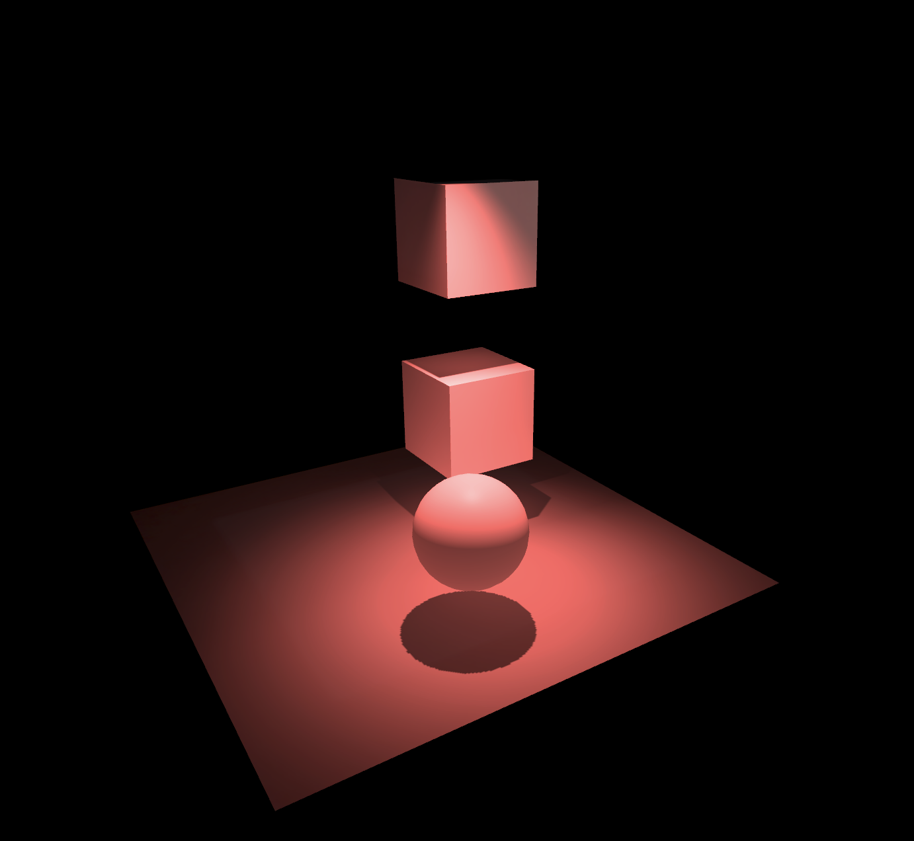

# UnityLight3D
## Direct Light vs Indirect Light
- Direct light changes the cool of the surface of an object.

- Indirect Light gives a light bounce between objects, If the object is selected as a Global Illumination contributor in UNity, the light will bounce between them. it looks more realistic and happened in our real world. Indirect light is expensive and has been known as raytracing. Indirect light is widely used in the game industry as more hardware is supported.

## Baked Light/IndrectLight VS Realtime Light/IndrectLight
The biggest difference between them is the matter of performance. Baked

