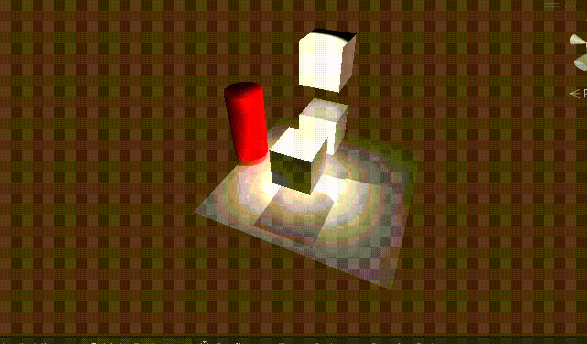

# UnityLight3D
## Direct Light vs Indirect Light
- Direct light changes the cool of the surface of an object.

- Indirect Light gives a light bounce between objects, If the object is selected as a Global Illumination contributor in UNity, the light will bounce between them. it looks more realistic and happened in our real world. Indirect light is expensive and has been known as raytracing. Indirect light is widely used in the game industry as more hardware is supported.

## Baked `Light/IndirectLight` VS Realtime `Light/IndirectLight`
The biggest difference between them is the matter of performance. Baked light/indirect will be saved into Lightmap. It increases the game size but reduces the performance issues. But real-time light/indirect will reduce the package sizes but has nice graphics, and also support dynamic objects.
### Baked `Light/IndirectLight`
- Light->Baked Global illumination->shadowmask (I baked shadow too)
- Project Setting->Quality->ShadowMask Mode->ShadowMask (all shadows are baked)
- Splot Light in Hierarchy->General->Mode->Baked

All lights, indirect, and shadows are precomputed on texture, if you move the texture, the object looks strange. so Baked light is usually used for static objects.

