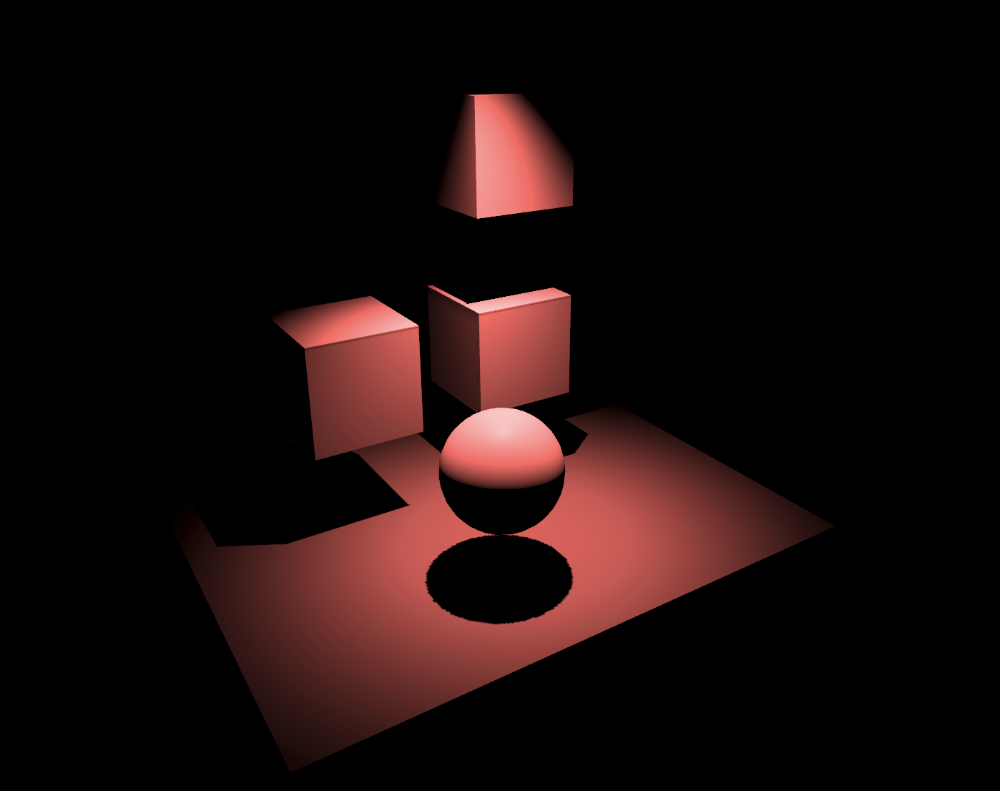

# UnityLight3D
## Direct Light vs Indirect Light
- Direct light changes the cool of the surface of an object.

## Baked Light/IndrectLight VS Realtime Light/IndrectLight
The biggest difference between them is the matter of performance. Baked

