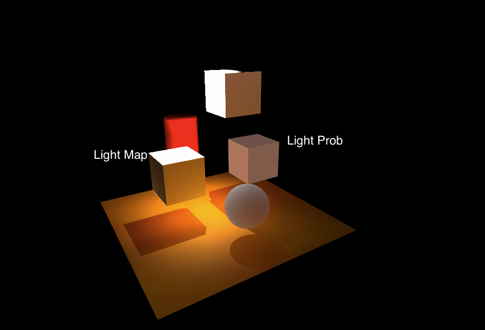

# UnityLight3D
## Direct Light vs Indirect Light
- Direct light changes the cool of the surface of an object.

- Indirect Light gives a light bounce between objects, If the object is selected as a Global Illumination contributor in UNity, the light will bounce between them. it looks more realistic and happened in our real world. Indirect light is expensive and has been known as raytracing. Indirect light is widely used in the game industry as more hardware is supported.

## Baked VS Realtime VS Mixed For Direct Light/Indirect Light/Shadow
The biggest difference between them is the matter of performance. Baked light/indirect will be saved into Lightmap. It increases the game size but reduces the performance issues. But real-time light/indirect will reduce the package sizes but has nice graphics, and also support dynamic objects. Mixed is using both advantages from them.

### Baked
- Light->Baked Global illumination->shadowmask (I baked shadow too)
- Project Setting->Quality->ShadowMask Mode->ShadowMask (all shadows are baked)
- Splot Light in Hierarchy->General->Mode->Baked

All lights, indirect, and shadows are precomputed on texture, if you move the texture, the object looks strange. so Baked light is usually used for static objects.

### Realtime
- Light->Realtime Global Illumination and uncheck Baked Global Illumination
- Project Setting->Quality->ShadowMask Mode->Distance Shadow(shadows have different quality from camera distance to objects)
- Splot Light in Hierarchy->General->Mode->Realtime
It is real-time for direct/indirect light and shadows, the scene looks more realistic but might cause performance issues.

### Mixed Light Mode
- Light->Baked Global illumination->shadowmask (I baked shadow too)
- Project Setting->Quality->ShadowMask Mode->ShadowMask (all shadows are baked, but dynamic objects are distance shadows)
- Splot Light in Hierarchy->General->Mode->Mixed
The light set has mixed light mode, we can bake light for static objects, and real-time light for dynamic objects. This solution is best for game performances.

## Light Prob VS Light Map
Light prob receives lights from Light Probe Group, even though the object is static. Dynamic objects have better graphics quality with light prob because they can't create light maps. A light map is precomputed texture on objects. In general, light Map has better graphs.
- GameObject-> Mesh-> Receive Global Illumination

## Contribute Global illumination
- The object will be set as static once it is selected. It will also generate a baked shadow for this object. Dynamic objects don't select this option. 
- Unchecked it with Mixed Light, the objects can receive lights from the light prob group.

## Probes
- Objects can receive the environment light from the probes groups. The probes groups compute the light information and simulate the surrounding illumination. It is not global illumination but has relatively good light effects for dynamic objects compared with static global illumination objects.

## Static VS Dynamic Objects
- Shadows, Light, and Indirect map are using the same UV
- Light Probs work for Dynamic objects
- Static objects can't use prob
- Dynamic objects can't use the light map